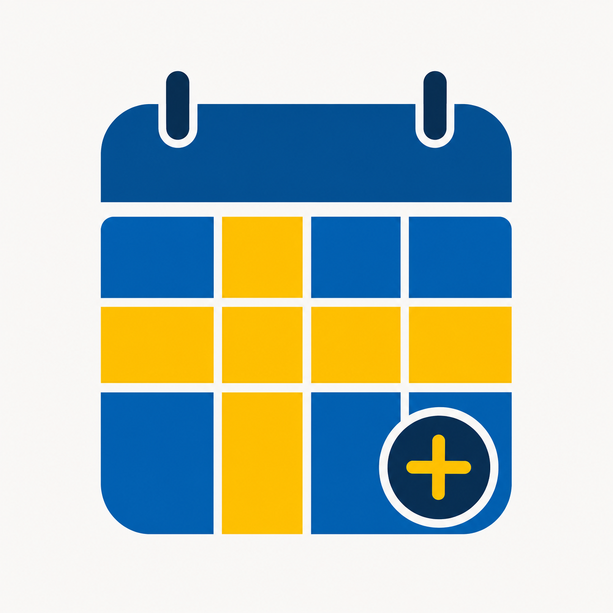

# Swedish Calendar Plus

<p align="center">
  
</p>

A custom Home Assistant integration for Swedish holidays, holiday eves, bridge
days, official flag days, name days, and theme days, with Swedish and English
localization.

One installation supports multiple configurable calendars, such as:

- all supported Swedish calendar events;
- public holidays and red days only;
- name celebration days only.

It also exposes one shared set of date-related sensors.

## Installation

### HACS

[](https://my.home-assistant.io/redirect/hacs_repository/?owner=Noirax90&repository=swedish_calendar_plus&category=integration)

Use the button above to open the repository in HACS. Alternatively, add it as a
custom repository manually:

1. Open **HACS → Integrations**.
2. Open the menu and select **Custom repositories**.
3. Enter `https://github.com/Noirax90/swedish_calendar_plus` and select
   **Integration** as the category.
4. Install **Swedish Calendar Plus** and restart Home Assistant.
5. Open **Settings → Devices & services → Add integration**, search for
   **Swedish Calendar Plus**, and complete the setup.

### Manual installation

1. Copy `custom_components/swedish_calendar_plus` into the
   `custom_components` directory in the Home Assistant configuration folder.
2. Restart Home Assistant.
3. Add **Swedish Calendar Plus** under
   **Settings → Devices & services → Add integration**.

To upgrade manually, replace the complete `swedish_calendar_plus` directory
and restart Home Assistant. Do not copy a new version over a partially removed
directory. To uninstall, remove the integration entry in Home Assistant before
deleting its custom-component directory.

## Configuration

The initial setup creates the integration, its shared sensors, and the first
calendar. To create another calendar, open **Settings → Devices & services →
Swedish Calendar Plus**, select **Add entry**, and choose **Calendar**. Every
calendar has its own name, event language, and category selection.

| Calendar category | Contents | Affects red-day sensors |
| --- | --- | --- |
| Legal holidays | Statutory holidays and optionally ordinary Sundays | Yes, through shared settings |
| Holiday eves | Established Swedish holiday eves | Only when selected as red in shared settings |
| Name days | Current names from Svenska Akademien | No |
| Theme days | Attributed events from Temadagar.se | No |
| Official flag days | Fixed, movable, and published election flag days | No |

Shared advanced settings control the sensor language and whether ordinary
Sundays, individual holiday eves, and bridge days count as red. A calendar can
inherit the shared holiday-eve selection or enable **Override shared holiday-eve
settings** and choose its own included eves. **Include bridge days** is always a
calendar-specific display setting; it does not change the shared red-day policy.

### Entities

| Entity name | Platform | Purpose |
| --- | --- | --- |
| Red day | Binary sensor | Whether today is red under the shared policy; includes reason attributes |
| Public holiday | Binary sensor | Whether today is a named statutory public holiday |
| Holiday eve | Binary sensor | Whether today is an established holiday eve |
| Bridge day | Binary sensor | Whether today lies between two days off |
| Workday | Binary sensor | Monday-Friday and not red under the shared policy |
| Flag day | Binary sensor | Whether today is an official Swedish flag day |
| Week number | Sensor | Current ISO week number |
| Names today | Sensor | Comma-separated names celebrated today |
| Next red day | Sensor | Date, name, key, and type of the next configured red day |
| Days until next red day | Sensor | Number of days until the next configured red day |
| Update sources | Button | Manually downloads and validates name-day and theme-day data |
| User-created calendar | Calendar | Read-only filtered all-day events |

Entity names remain English in every UI language so Home Assistant can generate
stable ASCII-friendly entity IDs. You may rename entities in Home Assistant
without changing the integration's unique IDs.

### Optional source-update automation

The integration never accesses the network on its own. To refresh external
sources automatically, create an automation that presses **Update sources**.
Replace the entity ID below if Home Assistant generated a suffix or you renamed
the entity:

```yaml
alias: Update Swedish Calendar Plus sources weekly
triggers:
  - trigger: time
    at: "03:00:00"
conditions:
  - condition: time
    weekday:
      - mon
actions:
  - action: button.press
    target:
      entity_id: button.update_sources
mode: single
```

## Current functionality

The integration includes Sweden's legal public holidays under
Lag (1989:253) om allmänna helgdagar:

- fixed-date holidays;
- Easter and holidays calculated from Easter;
- Midsummer Day and All Saints' Day;
- ordinary Sundays, when enabled in the calendar configuration.

The integration is installed once. It creates one shared set of these entities:

- a red-day binary sensor;
- a public-holiday binary sensor for named legal holidays only;
- a holiday-eve binary sensor;
- a bridge-day binary sensor independent of whether bridge days count as red;
- an official flag-day binary sensor with the event key and localized name;
- a workday binary sensor for a standard Monday-Friday work week using the
  shared red-day policy;
- the current ISO week number;
- names celebrated today;
- the date, localized name, and type of the next configured red day;
- days until the next configured red day.

Sensor entity names are always English so their generated entity IDs remain
stable and ASCII-friendly. Dynamic names and attributes use the configured
shared sensor language.

All generated user-facing text is stored under `common` in
`translations/<language>.json`. Python code uses translation keys with English
fallback; source-owned person names and Temadagar.se titles are not translated.

Calendars are added beneath that integration entry. Every calendar independently
selects one or more categories:

- legal public holidays and, depending on the shared setting, ordinary Sundays;
- established calendar eves: Epiphany Eve, Easter Eve, Walpurgis Night, Whitsun
  Eve, Midsummer Eve, All Hallows' Eve, Christmas Eve, and New Year's Eve;
- official Swedish flag days under Förordning (1982:270), including calculated
  church holidays and published election dates;
- current name days published by Svenska Akademien;
- theme days published by Temadagar.se.

Each calendar also selects Swedish or English presentation. Theme-day titles
remain in the source language and every theme-day event contains a linked
Temadagar.se attribution in its description.

The shared advanced settings decide whether ordinary Sundays, individual
holiday eves, and bridge days count as red days. They are used by **Red day**,
**Next red day**, and **Days until next red day**. The red-day binary sensor
exposes `red_day_type`, `red_day_key`, and `red_day_name` attributes explaining
why the date is red.

Each calendar can inherit the shared holiday-eve choices or override them with
its own **Include ...** switches. **Include bridge days** is always a standalone
per-calendar setting and creates events named **Bridge day** in English or
**Klämdag** in Swedish. A weekday is a bridge day when it lies between two days
off; Saturdays and Sundays count as days off even though Saturdays are not
legally red days.

Name-day event summaries contain only the celebrated names separated by commas.
A separate shared holiday-eve binary sensor indicates whether today is an
established eve and exposes its localized name as an attribute.

Flag days are informational calendar events only. Selecting them does not make
a date red and does not affect workday, holiday, or next-red-day sensors. The
official list is based on
[Förordning (1982:270) om allmänna flaggdagar](https://rkrattsbaser.gov.se/sfst?bet=1982%3A270),
with the overview at [Statens arkiv](https://statensarkiv.se/flaggdagar/).
Ordinary parliamentary election days are calculated locally. European
Parliament election days are included only after their Swedish date has been
officially published because they have no permanent annual calendar rule.

The integration ships static source snapshots so name days and theme days work
offline. A shared **Update sources** button can download fresh datasets at
runtime. Both downloads must pass completeness and schema validation before
they are atomically stored in Home Assistant's `.storage` and activated; a
failure leaves the last-known-good runtime copy or bundled snapshot untouched.
The button exposes `last_successful_update` as a persisted UTC timestamp after
both sources have been updated successfully.

The integration never contacts either source automatically. Users who want a
schedule can create a normal Home Assistant automation that calls
`button.press` for the **Update sources** entity. This keeps update frequency and
network access fully under the user's control.

The complete latest known theme-day year is projected forward until a new
change is recorded. Theme-day records support `valid_from` and `valid_to`, and
both the runtime updater and development update tool effective-date moved,
added, and removed days so historical calendar results are not rewritten.

Successful source updates store the source URL, retrieval timestamp, normalized
record count, and SHA-256 dataset fingerprint. Identical downloads update the
successful-update timestamp without reloading the integration. After three
consecutive failures, Home Assistant creates a repair warning while continuing
to use the last-known-good data.

## Data scope and limitations

- Legal holidays and bridge days use today's Swedish rules. Results for older
  years are not intended to reproduce historical law changes.
- Name days represent the current Svenska Akademien name-day calendar projected
  onto the requested year, not historical name-day calendars.
- The bundled Temadagar.se snapshots cover 2026 and 2027. The latest complete
  snapshot is projected into later years until an update records a change;
  theme days before 2026 are not provided.
- Royal flag days reflect the current wording of Förordning (1982:270), not
  historical members of the Royal Family.
- European Parliament election flag days are included only for officially
  published Swedish election dates. The integration does not predict them.
- All calculations use Home Assistant's configured local timezone. Calendar
  events are read-only, all-day events.

## Acknowledgements

Special thanks to Ludeeus for
[integration_blueprint](https://github.com/ludeeus/integration_blueprint), which
was used as the foundation for this project.

## Support

Report reproducible problems through
[GitHub Issues](https://github.com/Noirax90/swedish_calendar_plus/issues). Include
the integration diagnostics from **Settings → Devices & services → Swedish
Calendar Plus → Download diagnostics** and relevant debug logs. Feature requests
are welcome through the repository's feature-request template.

## Development

Run `scripts/setup` to prepare the development environment and
`scripts/develop` to start Home Assistant with the custom integration mounted.

Run `python3 -m pytest` to execute the Home Assistant custom-component test
suite. Tests use the pinned `pytest-homeassistant-custom-component` release and
its matching Home Assistant version.

The integration source lives in
`custom_components/swedish_calendar_plus/`.

### Test in Docker

Docker Compose runs a test Home Assistant instance using the same Home Assistant
version as the automated test harness. The integration source is mounted
read-only into Home Assistant, so code changes are available after a restart.

```bash
docker compose up
```

Open `http://localhost:8123`, complete onboarding, then add **Swedish Calendar
Plus** under **Settings → Devices & services → Add integration**.

Stop and remove the test container with:

```bash
docker compose down
```

Home Assistant's generated test state is stored under `config/` and ignored by
Git. The checked-in `config/configuration.yaml` enables debug logging for this
integration. Use `docker compose logs -f homeassistant` to follow its logs.
